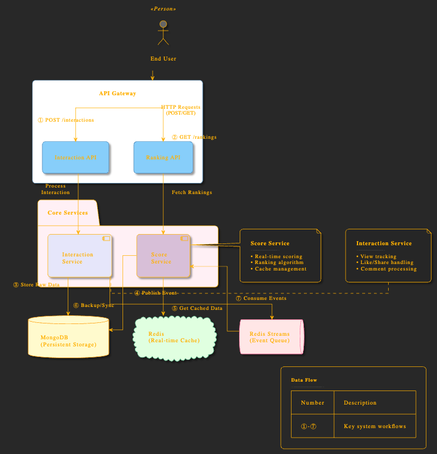

# Video Real-Time Ranking Server

A simple server built with Golang, using the Gin framework and MongoDB.

## Description

This project is in its initial phase, providing a foundation for future development. Planned features include:
- User reactions
- Video ranking based on scores

## Infrastructure

- **Backend**: Golang (Gin framework)
- **Database**: MongoDB
- **Cache**: Redis

## Why MongoDB?

MongoDB was chosen for its flexibility in handling evolving data structures, which is essential as the business logic is not yet finalized.

## Why Redis Pub/Sub?

Redis Pub/Sub is used in this architecture for its simplicity and low-latency message delivery. It allows the `Interaction Service` to publish events (e.g., user reactions) that the `Score Service` can consume in real-time. This enables:

1. **Real-Time Processing**:
   - Events are immediately available to subscribers, ensuring low-latency updates to rankings.

2. **Ease of Use**:
   - Redis Pub/Sub is simple to set up and integrate, making it a good choice for lightweight messaging needs.

3. **Integration with Redis Cache**:
   - Since Redis is already used for caching rankings, using its Pub/Sub feature reduces the need for additional infrastructure.

### Limitations of Redis Pub/Sub

While Redis Pub/Sub is effective for simple use cases, it has some limitations:

1. **No Message Persistence**:
   - If a subscriber is offline, it will miss messages published during its downtime.

2. **Limited Scalability**:
   - Redis Pub/Sub is not designed for high-throughput messaging or large-scale distributed systems.

3. **No Replay Capability**:
   - Messages cannot be replayed or retrieved once they are published.

### Why Consider Kafka?

Apache Kafka could be a better alternative for more complex or large-scale systems due to its:

1. **Message Durability**:
   - Kafka persists messages on disk, allowing subscribers to consume them even after downtime.

2. **High Throughput**:
   - Kafka is designed to handle large volumes of messages efficiently.

3. **Replay and Offset Management**:
   - Consumers can replay messages or start consuming from a specific offset, providing more flexibility.

4. **Scalability**:
   - Kafka can scale horizontally to handle increasing workloads.

### Conclusion

Redis Pub/Sub is suitable for this project due to its simplicity and low-latency characteristics. However, as the system grows and requires more robust messaging features, transitioning to Kafka could address the limitations of Redis Pub/Sub and provide better scalability and reliability.

## Project Structure

```
.
├── README.md
├── cmd
│   └── main.go
├── config
│   └── config.go
├── go.mod
├── go.sum
├── internal
│   ├── api
│   │   └── handler
│   │       ├── handler.go
│   │       ├── interaction.go
│   │       └── score.go
│   ├── common
│   │   ├── constant
│   │   │   ├── interaction.go
│   │   │   └── rediskey.go
│   │   └── util
│   │       └── util.go
│   ├── docs
│   │   ├── docs.go
│   │   ├── swagger.json
│   │   └── swagger.yaml
│   ├── entity
│   │   └── interaction.go
│   ├── infrastructure
│   │   ├── repository
│   │   │   ├── interaction.go
│   │   │   └── score.go
│   │   └── router
│   │       └── router.go
│   ├── registry
│   │   ├── interaction.go
│   │   ├── registry.go
│   │   └── score.go
│   └── usecase
│       ├── interaction
│       │   ├── implement.go
│       │   └── interface.go
│       └── score
│           ├── implement.go
│           └── interface.go
├── pkg
│   ├── mongo
│   │   └── mongo.go
│   └── redis.go
└── resources
    └── abi.json
```

## How to Run

Ensure you have Golang installed on your machine along with Go Swagger. Use the following command to initialize and run the server:

```bash
swag init -g internal/infrastructure/router/router.go -o internal/docs && go mod tidy && go mod download && go run ./cmd
```

# System Architecture Diagram



## Explanation

The diagram illustrates the flow of data and interactions between the components of the microservice architecture:

1. **User Interaction**:
   - The user interacts with the system by making HTTP requests to the API Gateway.
   - Example endpoints:
     - `POST /v1/interactions/:video_id`: To create a reaction.
     - `GET /v1/rankings/`: To fetch global rankings.
     - `GET /v1/rankings/:user_id`: To fetch personalized rankings.

2. **API Gateway**:
   - Routes requests to the appropriate microservices:
     - `Interaction API` for handling user interactions.
     - `Ranking API` for fetching rankings.

3. **Interaction Service**:
   - Processes user interactions (e.g., reactions).
   - Stores raw interaction data in MongoDB.
   - Publishes events to Redis Pub/Sub for further processing.

4. **Score Service**:
   - Consumes events from Redis Pub/Sub.
   - Updates scores in MongoDB and Redis Cache.
   - Provides real-time rankings from Redis Cache.
5. **Sorting in Redis**:
    - Redis provides a fast and efficient way to sort data using sorted sets (`ZSET`).
    - Example usage:
      - Add a score for a video:
         ```bash
         ZADD video_rankings <score> <video_id>
         ```
      - Retrieve top-ranked videos:
         ```bash
         ZREVRANGE video_rankings 0 9 WITHSCORES
         ```
      - Retrieve rankings for a specific video:
         ```bash
         ZRANK video_rankings <video_id>
         ```
    - This approach ensures real-time ranking updates and quick retrieval of sorted data.

5. **Data Stores**:
   - **MongoDB**: Stores persistent data for interactions and scores.
   - **Redis Cache**: Provides fast access to rankings.
   - **Redis Pub/Sub**: Acts as a message queue for event-driven communication between services.

